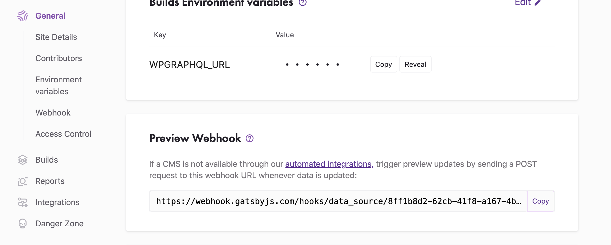

# Preview

This plugin supports [Preview](https://www.gatsbyjs.com/preview/) and has been designed to replicate the normal WordPress admin preview experience as closely as possible.

Once configured in the GatsbyJS settings page in wp-admin, Previews will work out of the box as long as you're using WordPress page/post uri's to build your Gatsby pages. See [this starter's gatsby-node.js](https://github.com/TylerBarnes/using-gatsby-source-wordpress-experimental/tree/master/gatsby-node.js) for an example of how to set up your Gatsby pages.

### Connecting Preview

To get started, set up a Preview instance on [Gatsby Cloud](https://www.gatsbyjs.com/) or set up your [self-hosted Preview instance](https://www.gatsbyjs.org/docs/running-a-gatsby-preview-server/). If you want to try out Preview but aren't sure wether you want to subscribe to Gatsby Cloud or self-host, you can start a free 2 week Gatsby Cloud trial with no credit card to help you make up your mind!

#### WordPress Settings

Navigate to your GatsbyJS WordPress settings by visiting this path in your WP instance `/wp-admin/options-general.php?page=gatsbyjs` or by hovering on "Settings" in the WordPress admin menu and clicking on "GatsbyJS".

You will see 4 fields related to Gatsby Preview. "Enable Gatsby Preview?", "Preview Instance", "Preview Webhook", and "Preview JWT secret".

If you don't see this settings page, or you don't see these 4 fields, make sure the latest version of WPGatsby is installed in your WordPress instance.

#### 1. "Enable Gatsby Preview?" Checkbox

When this checkbox is checked, WPGatsby will override the functionality of the WordPress "preview" button in the page/post edit screen. Clicking "preview" will open the regular WordPress preview template, but the WP frontend will be replaced with your Gatsby Preview instance.

#### 2. "Preview Instance" Field

This field should be filled with the public frontend URL of your Gatsby Preview instance.

To find your **Preview Instance URL**, navigate to the "Preview" tab in [Gatsby Cloud](https://www.gatsbyjs.com/dashboard/sites), wait for your first Preview build to complete, and then copy the frontend URL from above the build history list in the center of the page.

#### 3. "Preview Webhook" Field

You can find your **Preview webhook** by navigating to "Site Settings" in Gatsby Cloud and then navigating to "Webhooks" via the left-side menu. 

#### 4. Preview JWT secret

This field should be filled for you automatically with a cryptocraphically secure key when you install WPGatsby. If this field is empty, feel free to copy a salt from the [WordPress salts generator page](https://api.wordpress.org/secret-key/1.1/salt) and use that as your JWT secret key.

This secret key is used to authenticate short-lived JWT tokens when you're viewing previews from WordPress so a very strong key should be used to prevent security issues.

## How Preview works

When the WP "preview" button is pressed, a JWT is generated (with an expiry time of 30 seconds) and POST'ed to the Gatsby Preview instance webhook. The Preview instance then uses this short-lived JWT to request preview data for the page or post that's being previewed. At the same time, WordPress automatically opens the WP preview template which has been overridden by WPGatsby. Within the WP preview template you will see the admin bar at the top of the page as usual, but below that you will see an iframe containing your Gatsby Preview instance opened to the correct page for the current preview.

## Template safety

Be sure to guard against missing data in your templates using optional chaining so that missing data doesn't cause template errors. Trying to access properties on undefined will break your preview. For example, if you try to access `wpPost.acfFieldGroup.hero.content` but your Preview template receives `null` for `wpPost.acfFieldGroup`, your preview template will break. 

To guard against this you can use optional chaining by writing `wpPost?.acfFieldGroup?.hero?.content` instead.

## Debugging Previews

Since a Previewed post might have a lot less data attached to it than what you're testing with during development, you might get errors in previews when that data is missing. You can debug your previews by running Gatsby in preview mode locally.

- Run Gatsby in refresh mode with `ENABLE_GATSBY_REFRESH_ENDPOINT=true gatsby develop`
- Install ngrok with `npm i -g ngrok`
- In a new terminal window run `ngrok http 8000`
- In your WP instance's GatsbyJS settings, set your Preview instance URL to `https://your-ngrok-url.ngrok.io/8000` and your Preview webhook to `https://your-ngrok-url.ngrok.io/8000/__refresh`

Now when you click the preview button in `wp-admin` it will use your local instance of Gatsby. You can inspect the preview template to see which Gatsby page is being loaded in the preview iframe and open it directly to do further debugging.

:point_left: [Back to Features](./index.md)